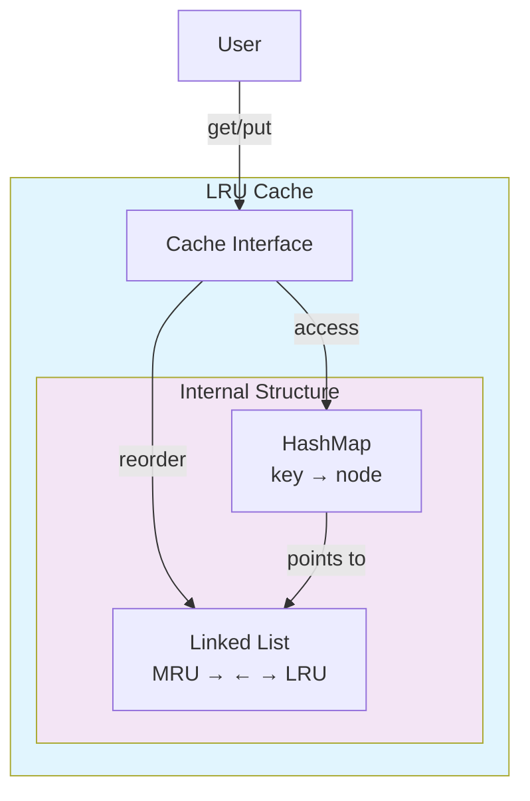

```mermaid
flowchart TD
    User[User]
    
    subgraph LRUCache[LRU Cache]
        API[Cache Interface]
        subgraph Internal[Internal Structure]
            HashMap[HashMap<br/>key → node]
            LinkedList[Linked List<br/>MRU → ← → LRU]
        end
    end

    User -->|get/put| API
    API -->|access| HashMap
    API -->|reorder| LinkedList
    HashMap -->|points to| LinkedList
    
    style LRUCache fill:#e1f5fe
    style Internal fill:#f3e5f5
```
